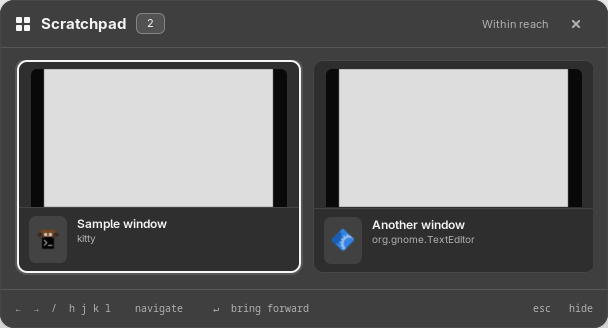
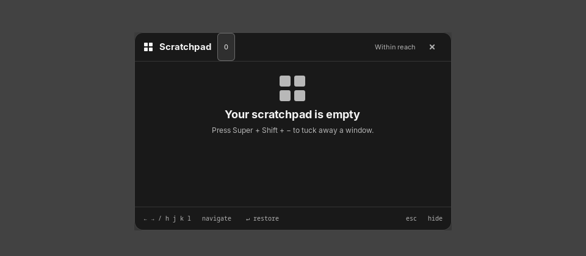

# Sway Nook

A small, native shelf for Sway’s scratchpad. Tuck windows away, browse saved previews in a translucent bottom shelf, and bring them back by mouse or keyboard.

Written in C with GTK 3. It opens on a shortcut, listens for Sway events while visible, and exits when closed. No background daemon or polling loop. The monochrome UI is themable; window previews stay opaque.



<details>
<summary>Empty shelf</summary>



</details>

## Build and install

Requires a running **Sway** session, **Grim**, **GTK 3**, **GTK Layer Shell**, and **JSON-GLib**. Building also requires a C compiler, Meson, Ninja, and pkg-config.

On Arch Linux:

```sh
sudo pacman -S --needed base-devel git meson ninja sway grim gtk3 gtk-layer-shell json-glib
git clone https://github.com/marvic2409/sway-nook.git
cd sway-nook
meson setup build --prefix="$HOME/.local" --buildtype=release
meson compile -C build
meson test -C build --print-errorlogs
meson install -C build
```

On other distributions, install the equivalent packages, including development headers for the three libraries, then use the same build commands.

## Sway setup

Add these bindings to `~/.config/sway/config`, replacing any existing scratchpad bindings on the same keys:

```sh
bindsym $mod+Shift+minus exec ~/.local/bin/sway-nook stash
bindsym $mod+minus exec ~/.local/bin/sway-nook toggle
```

Run `swaymsg reload` from a terminal inside Sway. With `$mod` set to `Mod4`, **Super+Shift+−** stashes the focused window and **Super+−** toggles the shelf. No autostart entry is needed.

For a system package installation, use `sway-nook` instead of `~/.local/bin/sway-nook`; [`config/sway-nook.conf`](config/sway-nook.conf) provides those bindings.

Click a card or press **Enter** to restore it. **Left/Right**, **Tab**, or **h/j/k/l** select a card; **Esc** closes the shelf. Grouped windows appear as one card and restore together.

Other commands (use the full binary path if it is not on your `PATH`):

```sh
sway-nook show          # open without toggling off
sway-nook list          # hidden windows as JSON
sway-nook restore 123   # restore a container ID returned by list
```

## Theme and previews

Copy the example config, then edit it:

```sh
mkdir -p ~/.config/sway-nook
cp config/theme.ini ~/.config/sway-nook/theme.ini
```

[`theme.ini`](config/theme.ini) controls colors (`#RRGGBB`) and panel/card opacities (`0`–`1`). Changes apply the next time the shelf opens. If you set `XDG_CONFIG_HOME`, place it under `$XDG_CONFIG_HOME/sway-nook/` instead. System packages install an example at `/usr/share/doc/sway-nook/theme.ini`.

Previews are saved snapshots, not live video. Use `sway-nook stash` to capture a window before hiding it; windows hidden by other commands may show a placeholder if Grim cannot capture them. UI transparency does not affect the previews.

Snapshots are stored in a private directory under `$XDG_RUNTIME_DIR/sway-nook-<uid>/`. Closed-window snapshots are pruned when the shelf refreshes; the runtime directory is temporary.

## Arch package

Install [`sway-nook`](https://aur.archlinux.org/packages/sway-nook) from the AUR:

```sh
git clone https://aur.archlinux.org/sway-nook.git
cd sway-nook
makepkg -si
```

To build the package from this source checkout, run `makepkg -si` in [`packaging/arch`](packaging/arch/). See [packaging notes](packaging/arch/README.md) for package contents.

## Development and license

After editing the C sources, run `meson compile -C build` and `meson test -C build --print-errorlogs`. Unit tests run without a compositor; UI testing requires Sway. GitHub Actions builds and tests every push and pull request.

Licensed under [GPL-3.0-only](LICENSE).
